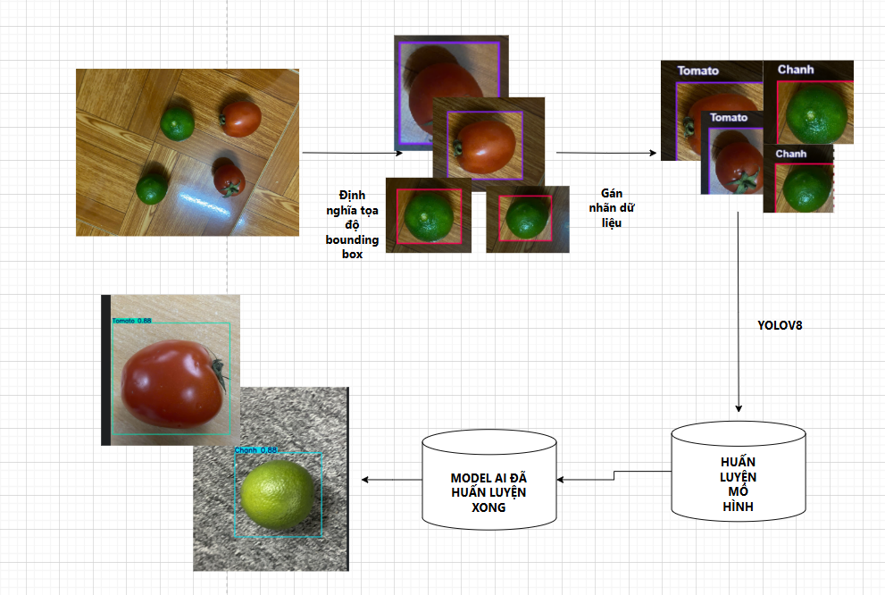

<h1 align="center">PHÂN LOẠI HOA QUẢ</h1>

  
  

<h2 align="center">PHÂN LOẠI HOA QUẢ</h2>

HỆ THỐNG PHÂN LOẠI HOA QUẢ SỬ DỤNG ESP32CAM VÀ BĂNG CHUYỀN

---

## 🌟 Giới thiệu

- **📌 Tự động nhận diện hoa quả** 
- **💡 Thông báo trực quan:** Arduino sẽ điều khiển cần gạt để đẩy quả về khay quy định
- **🖥️ Giao diện thân thiện:** .

---
## 🏗️ HỆ THỐNG!

  

---
## 📂 Cấu trúc dự án

📦 Project  
├── 📂 Dataset 
├── 📂 runs   
│   ├── 📂 detect
        ├── 📂 train
            ├── 📂 weights
├── 📂 templates  
│   ├── web_dashboard 
├── server.py  
├── test1.py 
├── tét.py
├── train_model.py
├── yolov8s.py

## 🛠️ CÔNG NGHỆ SỬ DỤNG

### 📡 Phần cứng
ARDUINO UNO
ESP32CAM
ESP8266
BĂNG CHUYỀN

### 🖥️ Phần mềm

## 🛠️ Yêu cầu hệ thống

### 🔌 Phần cứng
- **Arduino Uno** Điều khiển servo và kết nối với ESP8266
- **ESP32CAM** Tạo luồng stream video
- **ESP8266** Kết nối với flask gửi lệnh qua lại giữa flask arduino uno

### 💻 Phần mềm
- **🐍 Python 3+**
- **⚡ Arduino IDE** 

### 📦 Các thư viện Python cần thiết
Cài đặt các thư viện bằng lệnh:

    pip install ultralytics 
    pip install opencv-python

## 🚀 Hướng dẫn cài đặt và chạy
1️ Chuẩn bị phần cứng
- **Nạp mã Arduino**
- **Nạp mã ESP8266**
- **Nạp mã ESP32CAM**

   

2️ Cài đặt thư viện Python. 

Cài đặt Python 3 nếu chưa có, sau đó cài đặt các thư viện cần thiết bằng pip.

3 Huấn luyện mô hình
Chạy code trong train_model.py để huấn luyện mô hình từ dataset để xuất ra file train

4 Chạy các chương trình
Chạy Server.py đẻ hiển thị màn hình livestream camera để hiển thị phân loại

## 📰 Poster

  

## 🤝 Đóng góp
Dự án được phát triển bởi 4 thành viên:

| Họ và Tên        | Vai trò                  |
|----------------- |--------------------------|
| Vũ Tài Sang      | Phát triển toàn bộ mã nguồn, thiết kế cơ sở dữ liệu, kiểm thử, triển khai dự án và thực hiện video giới thiệu.|
| Trần Lê Bảo Long | Biên soạn tài liệu Overleaf, Poster, Powerpoint.|
| Phạm Đức Long    | Thiết kế slide PowerPoint, hỗ trợ bài tập lớn.  |
| Bùi Duy Anh      | Hỗ trợ bài tập lớn       |

© 2025 NHÓM 2, CNTT16-02, TRƯỜNG ĐẠI HỌC ĐẠI NAM
